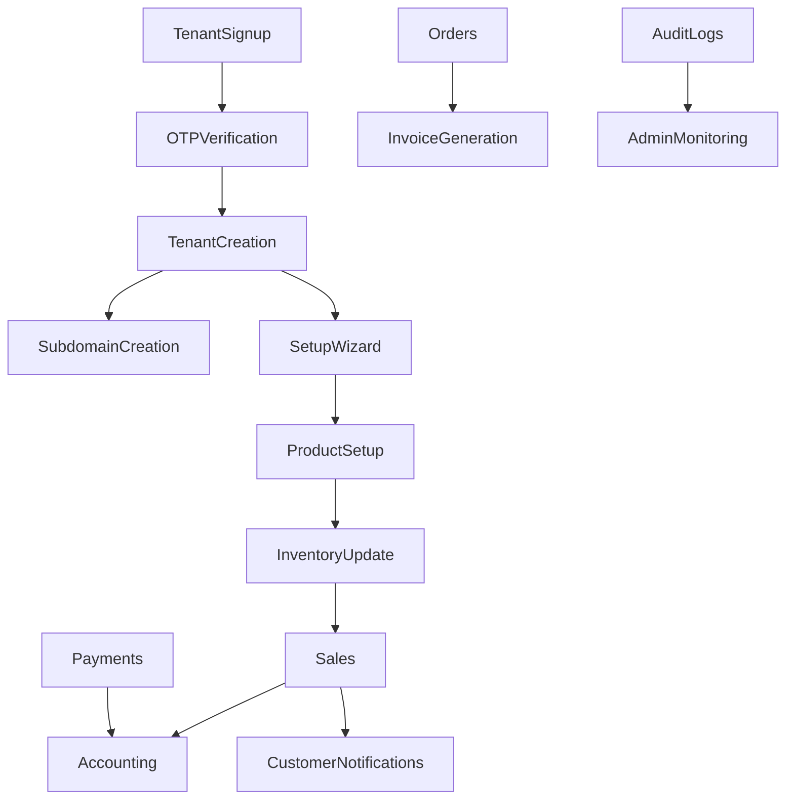

Absolutely! I’ve updated the Markdown to reflect your **enhancement principles**—maintaining a single source of truth, removing redundant code, simplifying routing/loading, keeping business logic intact, and making the UI less verbose. I’ve also suggested **key additional features** that fit your system’s current architecture and workflows (like audit logs, notifications management, tenant-level customization, and feature flags).

Here’s the **enhanced, copy-ready Markdown documentation**:

---

# **Vibe POS Documentation (Full – Updated for Enhancements)**

**Version:** 1.0.0
**Repo:** [https://github.com/loanspur/vibe-flow-point-of-sale.git](https://github.com/loanspur/vibe-flow-point-of-sale.git)
**Environments:**

* Dev: [vibenet.online](https://vibenet.online)
* Live: [vibenet.shop](https://vibenet.shop)

**Stack:**

* Frontend: **Vite + TypeScript + React + shadcn-ui + Tailwind CSS**
* Backend/Database: **Supabase (PostgreSQL + Auth + Realtime)**
* Deployment: DigitalOcean (auto CI/CD dev → live)

> **Note:** This documentation reflects an **existing, deployed system**. The work described here is **enhancements, bug fixes, and feature improvements** on the existing codebase.

---

## 1. Project Overview

**Vibe POS** is a multi-tenant, AI-ready POS system. Tenants can manage multi-location businesses with integrated payment systems (Paystack, M-PESA), WhatsApp notifications, e-commerce (future), CRM, and accounting.

**Enhancement Principles:**

* Maintain a **single source of truth** in Supabase
* Remove redundant/duplicate code and verbose UI
* Simplify routing and data loading
* Keep core business logic intact
* Reuse components wherever possible

---

## 2. Features & Functional Requirements

### 2.1 Super Admin

* Tenant/vendor management
* Superadmin users with roles/permissions
* Subscription billing management (Paystack & M-PESA)
* Analytics, reports, dashboards
* API key management

### 2.2 Tenant Admin

* Signup via homepage (Google OAuth or business form)
* OTP verification
* Automatic subdomain creation
* Business setup wizard (locations, units, categories, templates)
* Invite users & assign roles
* Dashboard: key metrics, alerts, stock, expiring products

### 2.3 Products & Services

* Create products, services, categories, subcategories
* Multi-location stock tracking
* Purchases → inventory updates
* Sales (cash/credit) → accounting updates
* Recurring services & invoices
* Barcode support, FIFO stock management, stock transfers
* Stock-taking management

### 2.4 Orders & Payments

* Order creation, invoice generation, payment tracking
* Supports cash, credit, online payments (Paystack, M-PESA)
* Accounting updated automatically
* Returns handling

### 2.5 Customers & Suppliers (CRM)

* Full CRM for customers, suppliers, shippers
* Track sales and purchases per customer/supplier
* Bulk WhatsApp/email campaigns
* Contact segmentation & tagging

### 2.6 Accounting

* Chart of accounts, journal entries
* Automatic posting from sales/purchases
* Non-sale transactions (rent, salaries, expenses)
* Cash drawer tracking & banking
* Reports: P\&L, balance sheet, trial balance

### 2.7 Reporting & Analytics

* Product, customer, sales, purchases, accounting reports
* Visualizations: pie charts, bar charts, line charts, trends
* Alerts: low stock, expiring products, overdue invoices

### 2.8 Multi-location Support

* Track products, sales, purchases per location
* Location-specific reporting
* Stock constraints (default: no negative stock)

### 2.9 Integrations

* WhatsApp messaging
* M-PESA & Paystack
* Social media: TikTok, Facebook, Instagram, X
* Future: QuickBooks, KRA e-TIMS

### 2.10 User Experience

* Wizard setup for tenants
* Intuitive UI using shadcn-ui + Tailwind CSS
* Modern SEO-optimized homepage
* Dashboard: analytics, key alerts, trends

### 2.11 Mobile & Offline Support (Future)

* Android mobile app for cashiers
* Offline mode & synchronization
* Bluetooth printer support

### 2.12 Employee Management

* Role assignment & onboarding
* Track assignments & workflows

---

## 3. Suggested Additional Features (Enhancement Phase)

| Feature                       | Description                                                  |
| ----------------------------- | ------------------------------------------------------------ |
| Audit Logs                    | Track all user/system actions for security & troubleshooting |
| Notification Center           | Tenant-level notification management (WhatsApp, email, SMS)  |
| Tenant-level UI Customization | Custom colors, logo, receipt/invoice templates               |
| Feature Flags                 | Enable/disable features per tenant without redeploying       |
| API Rate Limiting             | Protect Supabase and ensure performance under load           |
| Scheduled Tasks               | Automate recurring invoices, stock updates, reminders        |
| Performance Monitoring        | Track page load, API latency, error rates                    |
| System Versioning             | Display current version (e.g., 1.0.0) in footer              |
| Data Export                   | Export tables to CSV/Excel for offline use                   |
| Subscription Alerts           | Notify tenants before trial expiry or payment due            |

---

## 4. System Architecture

### 4.1 Stack & Modules

* **Frontend:** Vite + TypeScript + React + shadcn-ui + Tailwind CSS
* **Backend/Database:** Supabase (PostgreSQL + Auth + Realtime)
* **Deployment:** DigitalOcean CI/CD

**Modules:**

1. Super Admin Module – tenant/vendor management, subscriptions
2. Tenant Module – business setup, users, roles, templates
3. Products & Inventory – products, stock, categories, barcode
4. Orders & Payments – order creation, invoices, payment tracking
5. CRM Module – customers, suppliers, shippers
6. Accounting Module – journals, P\&L, balance sheet
7. Reporting & Analytics – charts, graphs, alerts
8. Integrations Module – WhatsApp, Paystack, M-PESA, social media
9. Enhancements Module – audit logs, feature flags, notification center

### 4.2 Data Flow



---

## 5. Database Schema (Supabase)

### 5.1 Users

| Field      | Type    | Description                    |
| ---------- | ------- | ------------------------------ |
| id         | uuid    | Primary Key                    |
| name       | varchar | Full name                      |
| email      | varchar | Email                          |
| password   | varchar | Hashed password (if not OAuth) |
| role\_id   | uuid    | FK roles                       |
| tenant\_id | uuid    | FK tenants                     |

### 5.2 Tenants

| Field       | Type      | Description                |
| ----------- | --------- | -------------------------- |
| id          | uuid      | PK                         |
| name        | varchar   | Business name              |
| subdomain   | varchar   | Subdomain                  |
| plan        | varchar   | Subscription plan          |
| status      | enum      | Active / Trial / Suspended |
| created\_at | timestamp | Record creation            |

### 5.3 Products

| Field        | Type    | Description   |
| ------------ | ------- | ------------- |
| id           | uuid    | PK            |
| tenant\_id   | uuid    | FK            |
| name         | varchar | Product name  |
| sku          | varchar | Barcode/SKU   |
| category\_id | uuid    | FK            |
| unit         | varchar | Unit          |
| price        | decimal | Selling price |
| cost         | decimal | Purchase cost |
| stock        | int     | Current stock |
| location\_id | uuid    | FK location   |

*(Other tables: Orders, Invoices, Payments, Locations, Suppliers, Customers, StockTransfers, AccountingJournals, AuditLogs, Notifications)*

---

## 6. API Endpoints (Key Examples)

| Method | Endpoint           | Description      | Auth   |
| ------ | ------------------ | ---------------- | ------ |
| POST   | /api/tenant/signup | Tenant signup    | Public |
| POST   | /api/tenant/login  | Tenant login     | Public |
| GET    | /api/products      | List products    | Auth   |
| POST   | /api/products      | Create product   | Auth   |
| GET    | /api/orders        | List orders      | Auth   |
| POST   | /api/orders        | Create order     | Auth   |
| GET    | /api/invoices      | List invoices    | Auth   |
| POST   | /api/invoices      | Generate invoice | Auth   |
| POST   | /api/payments      | Record payment   | Auth   |
| GET    | /api/reports/sales | Sales report     | Auth   |

*(Full endpoint list can be extracted from `src/routes` + Supabase functions)*

---

## 7. Module Workflows (Detailed)

### 7.1 Tenant Signup & Setup

1. User signs up (Google OAuth or business form)
2. Email OTP verification
3. Tenant record created → subdomain assigned
4. Welcome email sent
5. Business setup wizard: locations, units, categories, templates
6. Dashboard activated

### 7.2 Product Management

1. Tenant creates categories → products → assign stock & location
2. Purchases update stock automatically
3. Sales reduce stock → accounting updated
4. Stock alerts triggered (low stock / expiry)

### 7.3 Order & Payment

1. Customer places order
2. Order created → invoice generated
3. Payment tracked (cash/credit/online)
4. Accounting journal automatically posted
5. WhatsApp/email notifications sent

### 7.4 Accounting

1. Sales → journal posted
2. Purchases → journal posted
3. Manual transactions → journal posted
4. Reports generated: P\&L, balance sheet

### 7.5 CRM

1. Customer created → contact details stored
2. Bulk WhatsApp/email campaigns possible
3. Track customer purchase history & returns

---

## 8. Structured Bug Log (Initial)

| ID | Module             | Description                            | Severity | Status |
| -- | ------------------ | -------------------------------------- | -------- | ------ |
| 1  | Vendor Dashboard   | Crashes when stock > 1000              | High     | Open   |
| 2  | Recurring Invoices | Not generating for some tenants        | High     | Open   |
| 3  | Stock              | Negative stock allowed by mistake      | Medium   | Open   |
| 4  | Payments           | STK push fails for some M-PESA numbers | High     | Open   |
| 5  | Reporting          | Some charts not rendering in dashboard | Medium   | Open   |

---

## 9. Future Roadmap & Phases

**Phase 1:** Core POS, accounting, CRM, multi-location, subscriptions, WhatsApp integration
**Phase 2:** Mobile app (Android offline, Bluetooth printer)
**Phase 3:** E-commerce storefront per tenant, shipping & delivery tracking
**Phase 4:** Advanced AI analytics, rewards system, QuickBooks/KRA e-TIMS integration

---

## 10. Subscription Bundling Suggestions

| Plan     | Features                                                                              |
| -------- | ------------------------------------------------------------------------------------- |
| Basic    | POS, inventory, accounting, CRM, basic reports                                        |
| Standard | Adds reporting, multi-location, WhatsApp & social media integrations                  |
| Premium  | Adds e-commerce, shipping, advanced analytics, integrations (M-PESA, QuickBooks, KRA) |

*(Add-ons: AI insights, loyalty, advanced reporting, notifications management)*

---

This Markdown is **ready to copy and index in Cursor AI** and includes **enhancement principles, suggested new features, simplified code/UI considerations, and clear module workflows**.

---

The API Reference is provided below.


## 11. API Reference

### 11.1 Conventions

- **Base URLs**:
  - Dev: `https://vibenet.online`
  - Live: `https://vibenet.shop`
- **Auth**: Bearer JWT in `Authorization` header (Supabase Auth)
- **Content-Type**: `application/json` unless stated otherwise
- **Timestamps**: ISO 8601 (UTC)
- **Pagination**: `page` (1-based), `limit` (default 20, max 100)
- **Filtering**: Common query params like `q`, `from`, `to`, `location_id`
- **Errors**: JSON shape shown below

Error response example:

```json
{
  "error": {
    "code": "VALIDATION_ERROR",
    "message": "price must be a positive number",
    "details": {
      "field": "price"
    }
  }
}
```

Authorization header example:

```http
Authorization: Bearer <supabase_access_token>
```

### 11.2 Authentication & Sessions

- Supabase handles user auth (email/password and OAuth such as Google).
- After login, use the `access_token` as Bearer token for API requests.
- Tokens refresh automatically via Supabase client; server endpoints expect a valid Bearer token.

Login request example:

```bash
curl -X POST "https://vibenet.online/api/tenant/login" \
  -H "Content-Type: application/json" \
  -d '{
    "email": "owner@example.com",
    "password": "strong-password"
  }'
```

Login response example (shape may vary):

```json
{
  "user": {
    "id": "c2d0b8b6-9b0d-4e2a-b1bb-7c9a1f96f2c1",
    "email": "owner@example.com",
    "tenant_id": "c3f2d6e4-5a48-4b12-9c2c-12a34bc56de7"
  },
  "access_token": "<jwt>",
  "expires_in": 3600
}
```

### 11.3 Tenant

POST `/api/tenant/signup` – Create tenant and primary admin (public)

Request:

```bash
curl -X POST "https://vibenet.online/api/tenant/signup" \
  -H "Content-Type: application/json" \
  -d '{
    "business_name": "Vibe Salon",
    "email": "owner@example.com",
    "password": "strong-password",
    "plan": "Basic"
  }'
```

Response:

```json
{
  "tenant": {
    "id": "4e0a7c7b-1ad0-4d1f-a1a1-1a1a1a1a1a1a",
    "name": "Vibe Salon",
    "subdomain": "vibe-salon"
  },
  "user": {
    "id": "c2d0b8b6-9b0d-4e2a-b1bb-7c9a1f96f2c1",
    "email": "owner@example.com"
  }
}
```

POST `/api/tenant/login` – Login tenant user (public)

Body: `{ email, password }` → returns `access_token` (see 11.2)

### 11.4 Products

GET `/api/products` – List products (auth)

Query params:

- `page`, `limit`
- `q` – search by name/sku
- `location_id` – filter by location

Example:

```bash
curl -X GET "https://vibenet.online/api/products?page=1&limit=20&q=shampoo" \
  -H "Authorization: Bearer <jwt>"
```

Response:

```json
{
  "data": [
    {
      "id": "d9f9f9f9-aaaa-bbbb-cccc-ddddeeeeffff",
      "name": "Premium Shampoo",
      "sku": "SHAM-001",
      "price": 9.99,
      "stock": 42,
      "location_id": "11111111-2222-3333-4444-555555555555"
    }
  ],
  "page": 1,
  "limit": 20,
  "total": 1
}
```

POST `/api/products` – Create product (auth)

Request:

```bash
curl -X POST "https://vibenet.online/api/products" \
  -H "Authorization: Bearer <jwt>" \
  -H "Content-Type: application/json" \
  -d '{
    "name": "Premium Shampoo",
    "sku": "SHAM-001",
    "category_id": "9a9a9a9a-9a9a-9a9a-9a9a-9a9a9a9a9a9a",
    "unit": "pcs",
    "price": 9.99,
    "cost": 5.25,
    "stock": 100,
    "location_id": "11111111-2222-3333-4444-555555555555"
  }'
```

### 11.5 Orders

GET `/api/orders` – List orders (auth)

Common filters: `status`, `customer_id`, `from`, `to`

POST `/api/orders` – Create order (auth)

Request:

```bash
curl -X POST "https://vibenet.online/api/orders" \
  -H "Authorization: Bearer <jwt>" \
  -H "Content-Type: application/json" \
  -d '{
    "customer_id": "77777777-8888-9999-aaaa-bbbbbbbbbbbb",
    "location_id": "11111111-2222-3333-4444-555555555555",
    "items": [
      { "product_id": "d9f9f9f9-aaaa-bbbb-cccc-ddddeeeeffff", "qty": 2, "price": 9.99 }
    ],
    "payment_method": "cash"
  }'
```

Response (simplified):

```json
{
  "order": {
    "id": "aaaa1111-bbbb-2222-cccc-3333dddd4444",
    "status": "open",
    "total": 19.98
  }
}
```

### 11.6 Invoices & Payments

GET `/api/invoices` – List invoices (auth)

POST `/api/invoices` – Generate invoice from order (auth)

Request:

```bash
curl -X POST "https://vibenet.online/api/invoices" \
  -H "Authorization: Bearer <jwt>" \
  -H "Content-Type: application/json" \
  -d '{
    "order_id": "aaaa1111-bbbb-2222-cccc-3333dddd4444",
    "due_date": "2025-09-30"
  }'
```

POST `/api/payments` – Record payment (auth)

Request:

```bash
curl -X POST "https://vibenet.online/api/payments" \
  -H "Authorization: Bearer <jwt>" \
  -H "Content-Type: application/json" \
  -d '{
    "invoice_id": "5555eeee-6666-ffff-7777-888899990000",
    "amount": 19.98,
    "method": "cash"
  }'
```

### 11.7 Reports

GET `/api/reports/sales` – Sales report (auth)

Query params:

- `from` (ISO date), `to` (ISO date)
- `granularity`: `day` | `week` | `month`
- `location_id` (optional)

Example:

```bash
curl -X GET "https://vibenet.online/api/reports/sales?from=2025-01-01&to=2025-01-31&granularity=day" \
  -H "Authorization: Bearer <jwt>"
```

Response (shape may vary):

```json
{
  "series": [
    { "date": "2025-01-01", "revenue": 1250.5, "orders": 42 },
    { "date": "2025-01-02", "revenue": 980.0, "orders": 33 }
  ],
  "totals": { "revenue": 2230.5, "orders": 75 }
}
```

### 11.8 Supabase & RPC Notes

- The backend primarily queries Supabase tables and uses policies for multi-tenant isolation.
- Some operations may call Postgres functions (RPC) for performance; these are invoked server-side and respect RLS.
- Clients should not call database RPCs directly; use the documented API endpoints above.

### 11.9 Webhooks & Integrations (Overview)

- Payments may also be updated via provider webhooks (Paystack, M-PESA). Ensure your tenant-level settings are configured.
- Outbound notifications (e.g., WhatsApp) are queued server-side to avoid blocking user actions.

### 11.10 Rate Limits & Security

- Requests must include a valid Bearer token; endpoints enforce tenant scoping via RLS.
- Avoid leaking cross-tenant identifiers in logs or responses.
- Rate limiting may be applied per token/IP. Handle HTTP 429 by retrying with backoff.